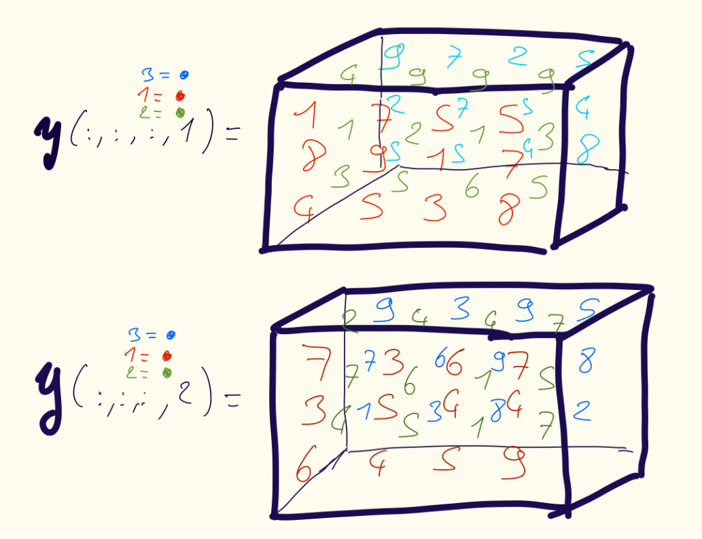

# 2.3 Unfolding or Matricization of Tensor

A tensor $X$ of size $n_1 \times n_2 \times \dots \times n_d$ is unfolded to a matrix of size $M \times N$, it must be cast that $MN = \prod_{k=1}^dn_k$.

## 2.3.1 Unfolding 3-way Tensor

For a 3-way tensor of size $m \times n \times p$, we can unfold it of 3 different ways, $m \times np$, $n \times mp$ or $p \times nm$.
Let take the following example:
```math

A(;,;,1) = \begin{bmatrix} 1 & 2 \\ 3 & 4 \end{bmatrix}, \qquad A(;,;,2) = \begin{bmatrix} 5 & 6 \\ 7 & 8 \end{bmatrix}

```

And the following unfolding:

```math
\begin{aligned}
X_{(1)} = \begin{bmatrix} 1 & 2 & 5 & 6\\
                          3 & 4 & 7 & 8
                          \end{bmatrix} \\[8pt]
X_{(2)} = \begin{bmatrix} 1 & 3 & 5 & 7\\
                          2 & 4 & 6 & 8
                          \end{bmatrix} \\[8pt]
X_{(3)} = \begin{bmatrix} 1 & 2 & 3 & 4\\
                          5 & 6 & 7 & 8
                          \end{bmatrix}
\end{aligned}
```

<br>

> **Definition (Mode-1 Unfolding of a 3-way Tensor)** <br>
> For a tensor $X \in \mathbb{R}^{m \times n \times p}$, the **mode-1 unfolding** is denoted as $X_{(1)}$ and is a matrix of size $m \times np$ such that
```math
\begin{aligned}
X_{(1)} = \begin{bmatrix} x_{111} & x_{121} & \dots & x_{1np} \\
                          x_{211} & x_{221} & \dots & x_{2np} \\
                          \dots     &   \dots   &   \dots &  \dots    \\
                          x_{m11} & x_{m21} & \dots & x_{mnp} \end{bmatrix}  
\\[8pt]
\end{aligned}
X_{(1)}(i,l) = X(i,j,k) \text{ where } l = (k - 1)n+j.

```

<br>

> **Definition (Mode-2 Unfolding of a 3-way Tensor)** <br>
> For a tensor $X \in \mathbb{R}^{m \times n \times p}$, the **mode-2 unfolding** is denoted as $X_{(2)}$ and is a matrix of size $n \times mp$ such that
```math
\begin{aligned}
X_{(2)} = \begin{bmatrix} x_{111} & x_{211} & \dots & x_{m1p} \\
                          x_{121} & x_{221} & \dots & x_{m2p} \\
                          \dots     &   \dots   &   \dots &  \dots    \\
                          x_{1n1} & x_{2n1} & \dots & x_{mnp} \end{bmatrix}  
\\[8pt]
\end{aligned}
X_{(2)}(j,l) = X(i,j,k) \text{ where } l = (k - 1)m+i = \mathbb{L}(j,k).

```

<br>

> **Definition (Mode-3 Unfolding of a 3-way Tensor)** <br>
> For a tensor $X \in \mathbb{R}^{m \times n \times p}$, the **mode-2 unfolding** is denoted as $X_{(3)}$ and is a matrix of size $p \times mn$ such that
```math
\begin{aligned}
X_{(3)} = \begin{bmatrix} x_{111} & x_{211} & \dots & x_{mn1} \\
                          x_{112} & x_{212} & \dots & x_{mn2} \\
                          \dots     &   \dots   &   \dots &  \dots    \\
                          x_{11p} & x_{21p} & \dots & x_{mnp} \end{bmatrix}  
\\[8pt]
\end{aligned}
X_{(3)}(k,l) = X(i,j,k) \text{ where } l = (j - 1)m+i = \mathbb{L}(i,j).

```

## 2.3.2 Unfoldsing *d*-way Tensors

> **Definition (Mode-*k* Unfolding)**  
> The mode-*k* unfolding of a tensor $\mathbf{x}$ of size
> $n_1 \times n_2 \times \dots \times n_d$ is the matrix
> $\mathbf{X_{(k)}} \in \mathbb{R}^{n_k \times N_k}$, where  
> $N_k = \prod_{\substack{l=1 \\ l \neq k}}^d n_l$ and  
> $\mathbf{X_{(k)}}(i_k, \beta_k) = \mathbf{x}(i_1, \dots, i_d)$, with  
> $\beta_k = L(i_1, \dots, i_{k-1}, i_{k+1}, \dots, i_d)$.

<br> 

> **Definition (General Unfolding)** <br>
> Let the modes $\\{1, \dots, d\\}$ be partitionned into two ordered sets: <br>
> $\mathfrak{R} = (r_1, r_2, \dots, r_{\delta})$ and $\mathfrak{C} = (c_1, c_2, \dots, c_{d - \delta})$. <br>
> The **unfolding** of a tensor $\mathbf{x}$ of size $n_1 \times n_2 \times \dots \times n_d$ with respect to row set $\mathfrak{R}$ and column set $\mathfrak{C}$ is the matrix <br>
> $\mathbf{X_{\mathfrak{R} \times \mathfrak{C}}} \in \mathbb{R^{M \times N}},$ where $M = \prod_{k \in \mathfrak{R}}n_k$ and $M =  \prod_{k \in \mathfrak{C}}n_k$, <br>
> and defined by $\mathbf{X_{\mathfrak{R} \times \mathfrak{C}}}(\alpha, \beta) = \mathbf{x}(i_1, i_2, \dots, i_d)$, where  <br>
> $\alpha = \mathbb{L}(i_{r_1}, i_{r_2}, \dots, i_{r_{\delta}}) \in [M]$ and $\beta = \mathbb{L}(i_{c_1}, i_{c_2}, \dots, i_{c_{d - \delta}}) \in [N]$

<br> 

If the linearization of the tensor and its unfolding are identical, then there are no **memory movement** cost.

<br>
<br>

## Exercises

> **Exercise 2.23** <br>
> Prove $X_{(1)} = reshape(X, m \times np)$.

### Solution - Exercise 2.23

<br> <br>

> **Exercise 2.24** <br>
> Let the $2 \times 2 \times 2$ tensor $X$ be given by figure 1. <br>
> What are $X_{(1)}$, $X_{(2)}$ and $X_{(3)}$?

> Figure 1
 ```math
X(;,;,1) = \begin{bmatrix} 8 & 7 \\ -3 & 9 \end{bmatrix}, \qquad X(;,;,2) = \begin{bmatrix} -1 & 4 \\ 0 & 5 \end{bmatrix} 
```

### Solution - Exercise 2.24


```math
X_{(1)} = \begin{bmatrix} 8 & 7 & -1 & 4\\
                          -3 & 9 & 0 & 5
                            \end{bmatrix}
```
```math
X_{(2)} = \begin{bmatrix} 8 & -3 & -1 & 0\\
                          7 & 9 & 4 & 5
                            \end{bmatrix}
```
```math
X_{(3)} = \begin{bmatrix} 8 & 7 & -3 & 9\\
                          -1 & 4 & 0 & 5
                            \end{bmatrix}
```

<br> <br> 

> **Exercise 2.25 (Alternate Column Order in Unfolding)** <br>
> The natural ordering preserves the frontal slices and is generally the default. However, we could certainly change the ordering from the column indices. Consider: <br>
> $\hat{\mathbf{X_{(1)}}}(i,l) = \mathbf{x}(i,j,k),$ where $l = \mathbb{L}^{\*}(j,k)$ and $(j,k) = \mathbb{T}^*(l)$ <br>
> What is $\hat{\mathbb{X}}_{(1)}$ for the tensor $\mathbf{x}$ from the figure 2?

> Figure 2
```math
X(:,:,1) =
\begin{bmatrix}
3 & 9 & 1 \\
8 & 2 & 1 \\
4 & 3 & 9
\end{bmatrix}, \quad
X(:,:,2) =
\begin{bmatrix}
6 & 9 & 5 \\
5 & 6 & 4 \\
1 & 4 & 1
\end{bmatrix}
```

### Solution - Exercise 2.25

We firstly increment $k$ before $j$ since it's $\mathbb{L}^*$, so we have the tuple $(1,1) (1,2) (2,1) (2,2) (3,1) (3,2)$.

```math

\hat{\mathbb{X}}_{(1)} =
\begin{bmatrix}
3 & 6 & 9 & 9 & 1 & 5 \\
8 & 5 & 2 & 6 & 1 & 4 \\
4 & 1 & 3 & 4 & 9 & 1
\end{bmatrix}


```

<br> <br> 

> **Exercise 2.26** <br>
> Prove that the mode-1 unfolding has the same linearization as the tensor, *i.e.*, $vec(\mathbf{x}) = vec vec(\mathbb{X_{(1)}}).$ Hint: Use the composition of linearization.

### Solution - Exercise 2.26

<br> <br> 

> **Exercise 2.27** <br>
> For the tensor $\mathbb{y}$ in figure #, what is $\mathbb{Y_{(1)}}, \mathbb{Y_{(3)}}, \mathbb{Y_{(4)}}?$



### Solution - Exercise 2.26

```math
\mathbb{Y_{(1)}} = \begin{bmatrix} 1 & 7 & 5 & 5 & 4 & 9 & 9 & 9 & 9 & 7 & 2 & 5 & 7 & 3 & 6 & 7 & 2 & 4 & 4 & 7 & 9 & 3 & 9 & 5 \\
                                   8 & 9 & 1 & 7 & 1 & 2 & 1 & 3 & 2 & 7 & 5 & 4 & 3 & 5 & 4 & 4 & 7 & 6 & 1 & 5 & 7 & 6 & 9 & 8 \\
                                   4 & 5 & 3 & 8 & 3 & 5 & 6 & 5 & 5 & 5 & 4 & 8 & 6 & 4 & 5 & 9 & 4 & 5 & 1 & 7 & 1 & 3 & 8 & 2 \end{bmatrix}
```

```math
\mathbb{Y_{(3)}} = \begin{bmatrix} 1 & 8 & 4 & 7 & 9 & 5 & 5 & 1 & 3 & 5 & 7 & 8 & 7 & 3 & 6 & 3 & 5 & 4 & 6 & 4 & 5 & 7 & 4 & 9 \\
                                   4 & 1 & 3 & 9 & 2 & 5 & 9 & 1 & 6 & 9 & 3 & 5 & 2 & 7 & 4 & 4 & 6 & 5 & 4 & 1 & 1 & 7 & 5 & 7 \\
                                   9 & 2 & 5 & 7 & 7 & 5 & 2 & 5 & 4 & 5 & 4 & 8 & 9 & 7 & 1 & 3 & 6 & 3 & 9 & 9 & 8 & 5 & 8 & 2 \end{bmatrix}
```

```math
\mathbb{Y_{(4)}} = \begin{bmatrix} 1 & 8 & 4 & 7 & 9 & 5 & 5 & 1 & 3 & 5 & 7 & 8 & 4 & 1 & 3 & 9 & 2 & 5 & 9 & 1 & 6 & 9 & 3 & 5 & 9 & 2 & 5 & 7 & 7 & 5 & 2 & 5 & 4 & 5 & 4 & 8\\
                                   7 & 3 & 6 & 3 & 5 & 4 & 6 & 4 & 5 & 7 & 4 & 9 & 2 & 7 & 4 & 4 & 6 & 5 & 4 & 1 & 1 & 7 & 5 & 7 & 9 & 7 & 1 & 3 & 6 & 3 & 9 & 9 & 8 & 5 & 8 & 2\end{bmatrix}
```

<br> <br> 

> **Exercise 2.28** <br>
> For a 3-way tensor $\mathbf{x}$ of size $m \times n \times p$, prove the following: <br>
> a) The mode-2 unfolding is equivalent to general matricization with $\mathfrak{R} = (2)$ and $\mathfrak{C} = (1,3)$. <br>
> b) The generalization matricization with $\mathfrak{R} = (1, \dots, d)$ and $\mathfrak{C} = \emptyset$ is equal to $\mathbf{X^T_{(3)}}.$

### Solutions - Exercise 2.28

<br> <br>

> **Exercise 2.29** <br>
> Prove the following: <br>
> a) The mode-*k* unfolding is a special case of general matricization with $\mathfrak{R} = (k)$ and $\mathfrak{C} = (1, \dots, k-1, k+1, \dots, d).$ <br>
> b) Vectorization is a special case of general matricization with $\mathfrak{R} = (1, \dots, d)$ and $\mathfrak{C} = \emptyset.$

### Solutions - Exercise 2.29

**a)**
In each exercises, we have the row set to $k$ and the columns to $(1, \dots, k-1, k+1, \dots, d)$. 


**b)**
Vectorization is equal to represent the tensor in $N \times 1$ matrix, so we have the empty set as $\mathfrak{C}$.

<br> <br> 

> **Exercise 2.30** <br>
> For the tensor in figure 3, what is its unfolding for $\mathfrak{R} = (1,4)$ and $\mathfrak{C} = (2,3)$?

### Solution - Exercise 2.30

```math
\mathbf{Y_{((1,4) \times (2,3))}} = \begin{bmatrix}
                                    1 & 7 & 5 & 5 & 4 & 9 & 9 & 9 & 9 & 7 & 2 & 5 \\
                                    8 & 9 & 1 & 7 & 1 & 2 & 1 & 3 & 2 & 7 & 5 & 4 \\
                                    4 & 5 & 3 & 8 & 3 & 5 & 6 & 5 & 5 & 5 & 4 & 8 \\
                                    7 & 3 & 6 & 7 & 2 & 4 & 4 & 7 & 9 & 3 & 9 & 5 \\
                                    3 & 5 & 4 & 4 & 7 & 6 & 1 & 5 & 7 & 6 & 9 & 8 \\
                                    6 & 4 & 5 & 9 & 4 & 5 & 1 & 7 & 1 & 3 & 8 & 2
\end{bmatrix}
```

<br> <br> 

> **Exercise 2.31** <br>
> Prove Proposition 1.

> **Proposition 1 (No Memory Mouvment Unfolding)** <br>
> For any $k \in [d],$ if $\mathfrak{R} = (1, \dots, k)$ and $\mathfrak{C} = (k+1, \dots, d),$ then for any *d*-way tensor, we have <br>
> $vec(\mathbf{x}) = vec(\mathbf{X_{(\mathfrak{R} \times \mathfrak{C})}}).$

### Solution - Exercise 2.31

<br><br> 

> **Exercise 2.32** <br>
> Let $\mathbf{x} \in \mathbb{R^{n_1 \times n_2 \times \dots \times n_d}}.$ Show <br>
> $\mathbf{X_{(d)}^T} = [vec(\mathbf{x}(:, \dots, :, 1)) vec(\mathbf{x}(:, \dots, :, 2)) \dots vec(\mathbf{x}(:, \dots, :, n_k))].$

### Solution - Exercise 2.32

<br> <br>

> **Exercise 2.33** <br>
> Let $\mathbf{x} \in \mathbb{R^{n_1 \times n_2 \times \dots \times n_d}}.$ Set $\mathbf{y} = \mathbf{x}(\mathbf{x}(:, \dots, :, 1) \in \mathbb{R^{n_1 \times n_2 \times \dots \times n_{d-1}}}$ for some $i_d \in [n_d]$. For $k < d$, show that the unfolding ranks are related as $rank(\mathbf{Y_{(k)}}) = 1$ if $rank(\mathbf{X_{(k)}}) = 1.$

### Solution - Exercise 2.33
