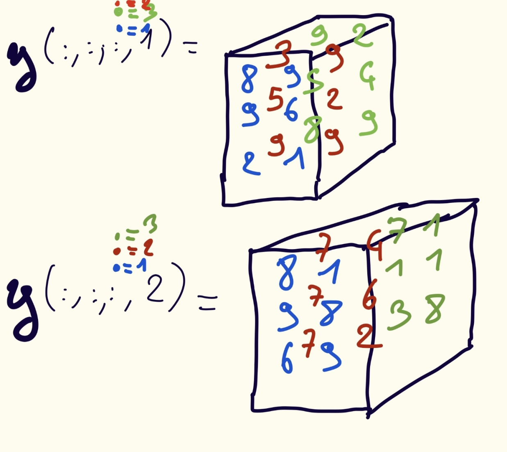
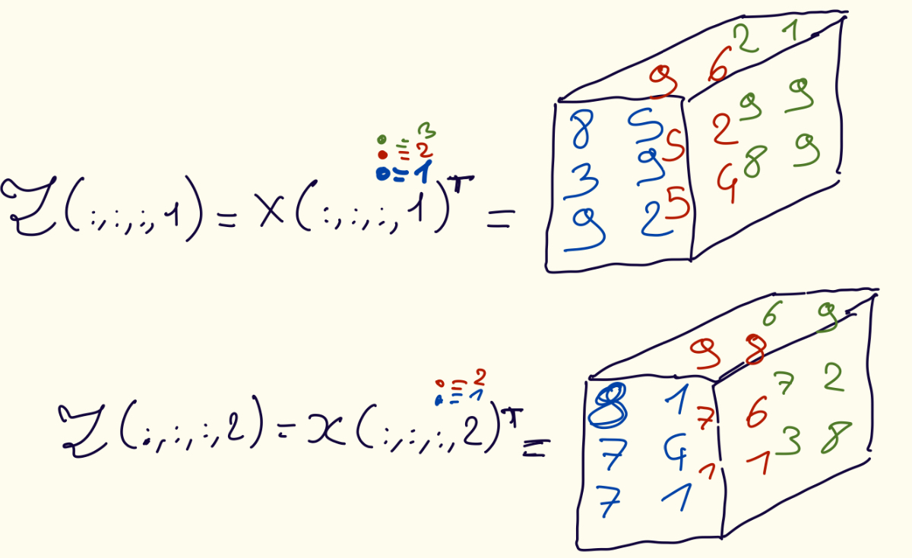

# 2.4 Permuting a Tensor

Tensor permutation is the analog of matrix transposition. *e.g.* if $\mathbf{Z}$ is the transpose of an $m \times n$ matrix $\mathbf{X}$, as $\mathbf{Z} = \mathbf{X}^T$, then we recall that $\mathbf{Z}(j,i) = \mathbf{X}(i,j)$ for all $(i,j) \in [m] \otimes [n].$

Tensor permutation is written as $\mathfrak{Z} = \mathbb{P}(\mathbf{x}, \pi)$ where $\pi = (\pi_1, \pi_2, \pi_3)$ is a permutation of $(1,2,3)$.

The permutation specifies the new order of the indices
The tensor values remain unchanged
Only the positions of the entries are rearranged

> **Example: Permutation (2,1,3)** <br>
> $\mathfrak{Z} = \mathbb{P}(\mathbf{X}, (2,1,3))$ means $\mathfrak{Z}(j,i,k) = \mathbf{x}(i,j,k)$ <br>
> Modes 1 and 2 are swapped. <br>
> Each frontal slice is transposed. <br>
> The tensor size changes from $m \times n \times p$ to $n \times m \times p.$

*Remark (Avoiding Tensor Permutation)* <br>
Tensor permutations are conceptually important, but they are expensive in practice because they require large amounts of data movement in memory.

<br>

> **Definition (Tensor Permutation)** <br>
> Let $\mathbf{x} \in n_1 \times n_2 \times \dots \times n_d$ and let $\pi = (\pi_1, \pi_2, \dots, \pi_d)$ be a permutation of $(1, \dots, d).$ Then we define <br>
> $\mathfrak{Z} = \mathbb{P}(\mathbb{x}, \pi)$ if $\mathfrak{Z}(i_{\pi_1}, i_{\pi_2}, \dots, i_{\pi_d}) = \mathbf{x}(i_1, i_2, \dots, i_d).$ <br>
> The permuted tensor $\mathfrak{Z}$ is of size $n_{\pi_1}, n_{\pi_2}, \dots, n_{\pi_d}.$

<br>

## 2.4.1 Permutations and Unfoldings

## Exercises

> **Exercise 2.34** <br>
> Let $\mathbf{x}$ be the $2 \times 2 \times 2$ in Figure 1. <br>
> a) What is $\mathbb{P}(\mathbf{x},(2,1,3))$? <br>
> b) What is $\mathbb{P}(\mathbf{x},(3,1,2))$

> Figure 1

```math
X(:,:,1) =
\begin{bmatrix}
8 & 2 \\
9 & 9
\end{bmatrix}, \quad
X(:,:,2) =
\begin{bmatrix}
6 & 3 \\
1 & 5
\end{bmatrix}
```

### Solutions - Exercise 2.34

We have $x_{111} = 8, x_{121} = 2, x_{211} = 9, x_{221} = 9, x_{112} = 6, x_{211} = 3, x_{122} = 1 and x_{222} = 5.$

**a)** <br>
It swap mode 1 and mode 2, leaving mode 3 unchanged. $\mathfrak{Z}(j,i,k) = \mathbf{x}(i,j,k)$
```math
\begin{aligned}
\mathfrak{Z}(:,:,1) = \mathbf{x}(:,:,1)^T = \begin{bmatrix} x_{111} & x_{211} \\ x_{121} & x_{221} \end{bmatrix} = \begin{bmatrix} 8 & 9 \\ 2 & 9 \end{bmatrix} \\[8pt]
\mathfrak{Z}(:,:,1) = \mathbf{x}(:,:,2)^T = \begin{bmatrix} x_{112} & x_{212} \\ x_{122} & x_{222} \end{bmatrix} = \begin{bmatrix} 6 & 1 \\ 3 & 5 \end{bmatrix} \\[8pt]
\end{aligned}
```

**b)** <br>
It swap mode 1 as mode 2, mode 2 as mode 3 and mode 3 as mode 1. $\mathfrak{Z}(k,i,j) = \mathbf{x}(i,j,k)$
```math
\begin{aligned}
\mathfrak{Z}(:,:,1) = \mathbf{x}(:,:,1)^T = \begin{bmatrix} x_{111} & x_{211} \\ x_{112} & x_{212} \end{bmatrix} = \begin{bmatrix} 8 & 9 \\ 6 & 1 \end{bmatrix} \\[8pt]
\mathfrak{Z}(:,:,1) = \mathbf{x}(:,:,2)^T = \begin{bmatrix} x_{121} & x_{221} \\ x_{122} & x_{222} \end{bmatrix} = \begin{bmatrix} 2 & 9 \\ 3 & 5 \end{bmatrix} \\[8pt]
\end{aligned}
```
<br> <br>

> **Exercise 2.35** <br>
> Let $X$ be the 4-way tensor of size $3 \times 2 \times 3 \times 2$ such that *(figure 2)* <br>
> a) What is $P(x, (3,2,1,4))$? <br>
> b) What is $P(x, (4,3,1,2))$?

> Figure 2


### Solutions - Exercise 2.34

**a)** 
It swap mode 1 as mode 3 (*vice versa*) and it let mode 2 and mode 4 unchanged. \$mathfrak{Z}(k,j,i,l) = \mathbf{x}(i,j,k,l)$


<br> <br>

> **Exercise 2.36** <br>
> For the $x$ for figure 3: <br>
> a) What is $vec(2,1,3)(x)?$ <br>
> b) What is $vec(3,2,1)(x)?$

> Figure 2

### Solutions - Exercise 2.34
