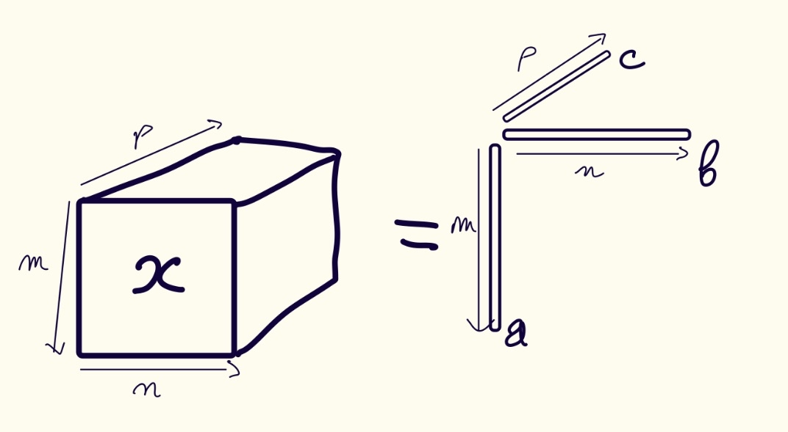
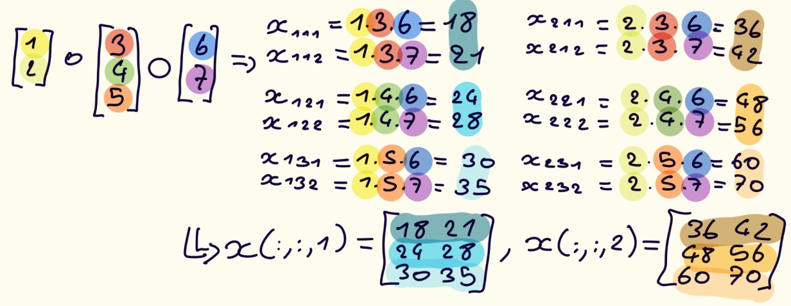

# 3.2 Outer Products

## 3.2.1 Outer Product of Three Vectors

Unlike the inner product, the outer product of three vectors generates a 3-way tensor.

> **Definition (Outer Product of Three Vectors)**  
> The **outer product** of vectors $a \in \mathbb{R}^m, b \in \mathbb{R}^n, c \in \mathbb{R}^p$ is denoted $a \circ b \circ c$ and produces an $m \times n \times p$ tensor, such that element $(i,j,k)$ equals $a_ib_jc_k$:

 

For the computational complexity of the outer product of vectors of length $m$, $n$ and $p$ is the product of sizes: $\mathcal{O}(mnp)$.

 

> **Definition (Rank-1 3-way Tensor)**  
> A 3-way Tnsor $\mathbf{x}$ is **rank 1** if it can be expressed as a vector outer product, *i.e.*, there exist vectors $\textbf{a, b, c}$ such that $\mathbf{x} = \textbf{a} \circ \textbf{b} \circ \textbf{c}$.   

 

Let show that with a simple example; 

 

Since the Kronecker product produces a vector with reverse linearization, you need to use the reverse Kronecker product to have it equal to the outer product.

 

   

## Exercises

> **Exercise 3.3**  
> Let $\text{a } \in \mathbb{R}^n, \text{ b } \in \mathbb{R}^m \text{ and c } \in \mathbb{R}^p$. Define $\mathbf{x} = a \circ b \circ c$ and $y = \mathrm{vec}(\mathbf{x}).$  
> Prove $y_l = a_ib_jc_k$, where $l = \mathbb{L}(i,j,k)$ for all $(i,j,k) \in [m] \otimes [n] \otimes [p]$.

### Solution - Exercise 3.3

   

> **Exercise 3.4**  
> Prove $\lVert a \circ b \circ c\rVert^2 = \lVert a\rVert_2^2\lVert b\rVert_2^2\lVert c\rVert_2^2.$

### Solution - Exercise 3.4

   

> **Exercise 3.5**  
> Prove Equations 1, 2 and 3 are each equivalent to equation 4 in the following Proposition.

> **Proposition (Vector Kronecker Product and Outer Product Connections (3-way))**  
> *Let* $\text{a } \in \mathbb{R}^n, \text{ b } \in \mathbb{R}^m \text{ and c } \in \mathbb{R}^p$. *The the following statements are equivalent:*  
> $\mathbf{x} = a \circ b \circ c,$  
> $\mathrm{vec}(\mathbf{x}) = c \otimes b \otimes a,$  
> $\mathbf{X}_{(1)} = a(c\otimes b)^T,$  
> $\mathbf{X}_{(2)} = b(c\otimes a)^T,$  
> $\mathbf{X}_{(3)} = c(b\otimes a)^T,$  
