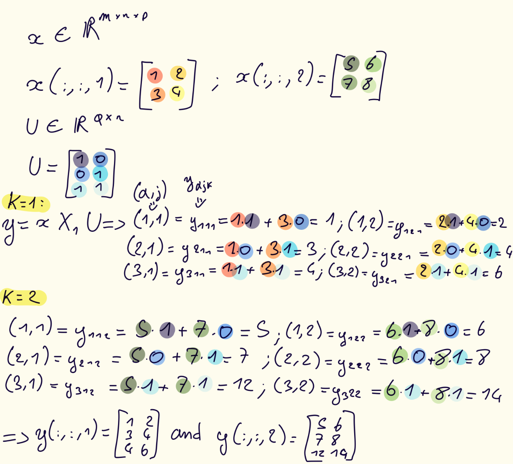
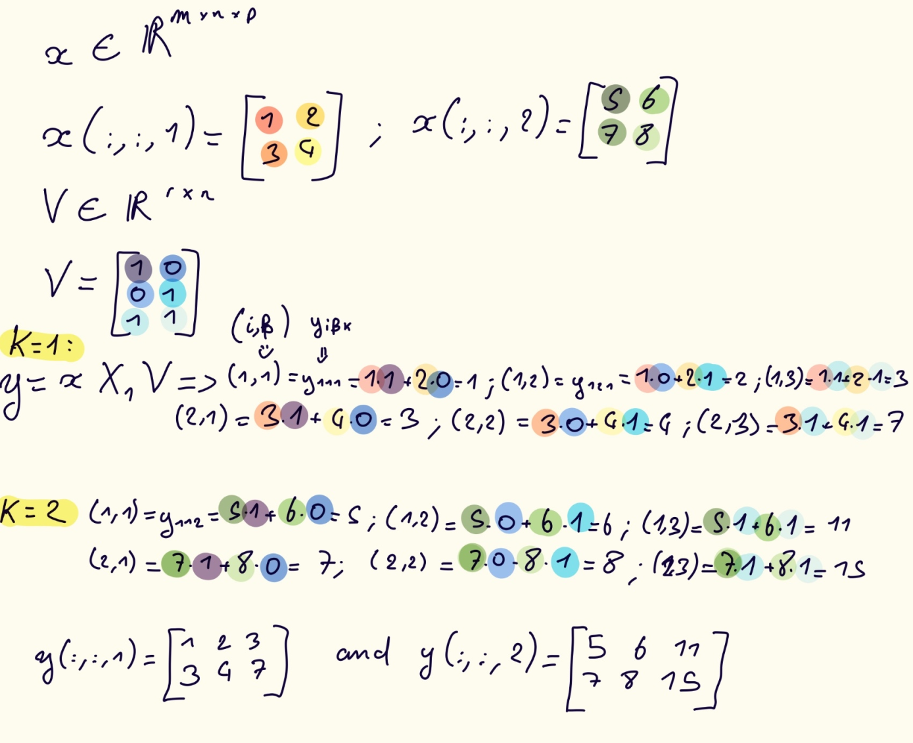
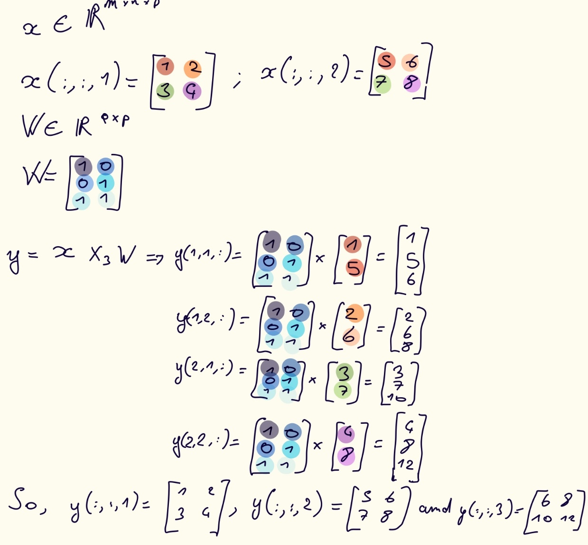

# 3.3 Tensor-Times-Matrix Products

> **Definition (Tensor-Times-Matrix Product)**  
> The mode-*k* **TTM product** of a tensor $\mathbf{x}$ with a matrix $\mathbf{U}$ is denoted as $\mathbf{y} = \mathbf{x} \times_k \mathbf{U}$ and defined in terms of the matricized expression:  
> $\mathbf{Y_{(k)}} = \mathbf{UX_{(k)}}$.

So in other words, the TTM $\mathbf{x} \times_k \mathbf{U}$ multiplies each mode-*k* fiber of $\mathbf{x}$ by $\mathbf{U}$.

 

## 3.3.1 TTM for 3-way Tensors
### Mode-1 TTM for 3-way Tensor

> **Definition (TTM in Mode 1)**  
> The **TTM operation in mode 1** of $\mathbf{x} \in \mathbb{R}^{m \times n \times p}$ with a matrix $\mathbf{U} \in \mathbb{R}^{q \times m}$ is denoted as  
> $\mathbf{y} = \mathbf{x} \times_1 \mathbf{U}$  
> and produces a $q \times n \times p$ tensor where the column (mode-1) fibers of $\mathbf{y}$ are equal to the corresponding column fibers of $\mathbf{x}$ multiplied by $\mathbf{U}$. Specially, $\mathbf{Y_{(1)}} = \mathbf{UX_{(1)}}$ or  
> $\mathbf{Y_{\alpha jk}} = \sum_{i=1}^mx_{ijk}u_{\alpha i}$ for all $(\alpha, j, k) \in [q] \otimes [n] \otimes [p].$

Here is a example:

### Mode-2 TTM for 3-way Tensor

> **Definition (TTM in Mode 2)**  
> The **TTM operation in mode 2** of $\mathbf{x} \in \mathbb{R}^{m \times n \times p}$ with a matrix $\mathbf{V} \in \mathbb{R}^{r \times n}$ is denoted as  
> $\mathbf{y} = \mathbf{x} \times_2 \mathbf{V}$  
> and produces a $m \times r \times p$ tensor where the column (mode-2) fibers of $\mathbf{y}$ are equal to the corresponding column fibers of $\mathbf{x}$ multiplied by $\mathbf{V}$. Specially, $\mathbf{Y_{(2)}} = \mathbf{VX_{(2)}}$ or  
> $\mathbf{Y_{i\beta k}} = \sum_{j=1}^nx_{ijk}u_{\beta j}$ for all $(i, \beta, k) \in [m] \otimes [r] \otimes [p].$

Here is a example:

### Mode-3 TTM for 3-way Tensor

> **Definition (TTM in Mode 3)**  
> The **TTM operation in mode 3** with a matrix $\mathbf{W} \in \mathbb{R}^{s \times p}$ is denoted as  
> $\mathbf{y} = \mathbf{x} \times_3 \mathbf{W}$  
> and produces a $m \times n \times s$ tensor where the tube (mode-3) fibers of $\mathbf{y}$ are equal to the corresponding column fibers of $\mathbf{x}$ multiplied by $\mathbf{W}$. Specially, $\mathbf{Y_{(3)}} = \mathbf{WX_{(3)}}$ or  
> $\mathbf{Y_{ij \gamma}} = \sum_{k=1}^px_{ijk}w_{\gamma k}$ for all $(i, j, \gamma) \in [m] \otimes [n] \otimes [s].$

Here is a example:

## TTM for *d*-way Tensors
For a tensor $\mathbf{x}$ of size $n_1 \times n_2 \times \dots \times n_d$, the **mode-*k* TTM** with a matrix $U \in \mathbb{R}^{m \times n_k}$ is denoted as $y = \mathbf{x} \times_k \mathbf{U}$.

   

## Exercises

> **Exercise 3.12 (TTM and Permutation)**  
> Prove $\mathbf{y} = \mathbf{x} \times_k \mathbf{U}$ if and only if $\mathbb{P}(\mathbf{y}, \pi) = \mathbb{P}(\mathbf{x}, \pi) \times_{\pi_k} \mathbf{U}.$

### Solution - Exercise 3.12

   

> **Exercise 3.13**  
> What is the arithmetic cost of $\mathbf{x} \times_2 \mathbf{v}$ with $\mathbf{x} \in \mathbb{R}^{m \times n \times p}$ and $\mathbf{v} \in r \times n?$

### Solution - Exercise 3.13

> **Exercise 3.14**  
> Let $\mathbf{x} \in \mathbb{R}^{m \times n \times p}$. Using the definition of the mode-2 unfolding and linear indexing, prove that  
> $\mathbf{X_{(2)}} = [\mathbf{B^T_1} \mathbf{B^T_2} \dots \mathbf{B^T_p}],$  
> where each $\mathbf{B}_k$ corresponds to the $m \times n$ frontal slices $\mathbf{x}(:,:,k).$

### Solution - Exercise 3.14
